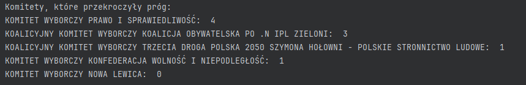

# Kalkulator wyborczy

Kalkulator pozwala na przeliczenie uzsykanej liczby głosów na liczbę mandatów w parlamencie (metodą d'Hondta).

## Wejście
Dwa pliki w folderze resources:
- [parties.csv](https://github.com/krzysztof-kopel/Election-calculator/blob/ef15f7d54481c2036fd04b44b70f8ade0018048c/resources/parties.csv) -> zawiera opis partii uczestniczących w wyborach
- [config.csv](https://github.com/krzysztof-kopel/Election-calculator/blob/ef15f7d54481c2036fd04b44b70f8ade0018048c/resources/config.csv) -> informacje konfiguracyjne, dotyczące liczby miejsc w parlamencie czy progu wyborczego (na ten moment nie uwzględniamy różnic między progiem dla komitetów zwykłych i koalicyjnych)

Przykładowe dane w plikach zostały zaczerpnięte z wyborów parlamentarnych 15.10.2023 r. w okręgu nr 27 (Bielsko-Biała, a także powiaty bielski, cieszyński, pszczyński i żywiecki).
